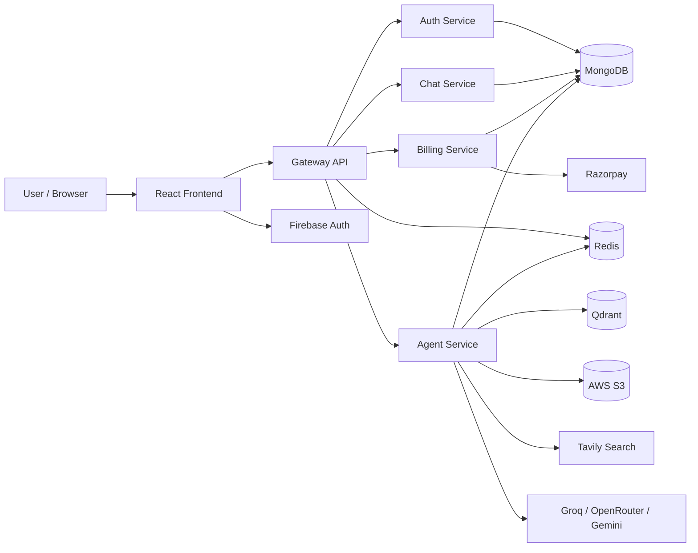
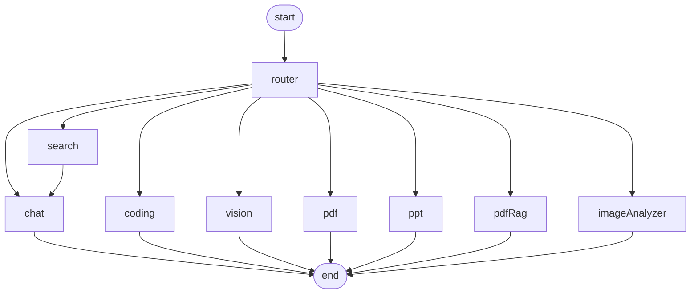

# Ciel-AI

**A multi-agent AI workspace for chat, coding, search, documents, images, and presentations.**

## Badges

| Type | Status |
| --- | --- |
| CI/CD | Not configured yet in this repository |
| Version | v1.0.0 in the backend packages, v0.0.0 in the frontend package |
| Coverage | No automated test suite is currently wired up |
| License | ISC |

## Project Overview 🚀

Ciel-AI is a full-stack, multi-service AI platform that routes each user request to the right specialist instead of forcing one model to do everything. The system supports general chat, coding assistance, live web search, PDF generation, PowerPoint generation, PDF question answering with RAG, and image understanding/generation.

It is designed for users who want one interface for several AI workflows: developers, content creators, students, analysts, and teams that need fast document and media generation. The main differentiator is the combination of a graph-based router, per-agent prompting, credit-based access control, Redis-backed memory, and artifact rendering inside the chat UI.

### Screenshots and Demo

Screenshots are not committed yet. When you add them, place them under a folder such as `docs/images/` and reference them here:

- `docs/images/home.png` for the landing/chat view
- `docs/images/artifact-panel.png` for generated code and preview output
- `docs/images/billing-drawer.png` for the upgrade flow

If you publish a demo later, add it here as a live link:

- Demo: add your deployed URL here
- Documentation: add your docs URL here

## Architecture & Design 🧱

The app is organized as a monorepo with a Vite React frontend and several Express-based backend services. Requests enter through a gateway service, which authenticates the user, enriches the request with the current user ID, and proxies traffic to the correct service.



### Design patterns used

| Pattern | Where it appears | Why it matters |
| --- | --- | --- |
| Gateway + proxy | `backend/gateway/index.js` | Keeps auth and routing in one place |
| Service decomposition | `backend/services/*` | Separates auth, chat, billing, and AI workloads |
| Graph-based orchestration | `backend/services/agent/graph/graph.js` | Routes each prompt to the right specialist |
| RAG | `backend/services/agent/agents/pdfRag.agents.js` | Answers questions from uploaded PDFs using retrieval |
| MVC-style service layout | controllers, routes, models | Keeps request handling, business logic, and persistence separated |
| Artifact pipeline | `frontend/src/component/Artifact.jsx` | Renders code and document outputs outside the chat thread |

### Data flow

1. The frontend authenticates the user with Firebase Google Sign-In.
2. The auth service verifies the Firebase token, creates or loads the user record, and stores a Redis session cookie.
3. The gateway checks the session cookie on protected routes and injects `x-user-id` into downstream requests.
4. The agent service receives the prompt, stores the user message, and invokes the LangGraph workflow.
5. The router chooses the best specialist: chat, coding, search, PDF, PPT, vision, PDF RAG, or image analysis.
6. The selected agent calls the relevant LLM, retrieval store, search API, or file service.
7. The response is saved back to the chat service and rendered in the frontend, including artifacts such as code files, PDF links, PPT links, or images.

### Why this approach

This architecture keeps the system practical under real usage:

- The gateway centralizes authentication and request enrichment instead of duplicating that logic across services.
- LangGraph lets the app route by intent and file type, which is more reliable than a single giant prompt.
- Redis memory reduces repeated database reads and gives the agents short context windows for faster responses.
- Artifact rendering keeps generated code and documents interactive without polluting the chat transcript.
- Credits and rate limits protect expensive model calls and make the product easier to operate commercially.

## Technology Stack ⚙️

| Layer | Tools |
| --- | --- |
| Frontend | React 19, Vite, Redux Toolkit, React Router, axios, motion, lucide-react, Monaco Editor, react-markdown, react-syntax-highlighter, styled-components |
| Backend | Node.js, Express 5, ESM modules, nodemon |
| AI / Orchestration | LangGraph, LangChain core, Groq, OpenRouter, Google Generative AI, Tavily |
| Data | MongoDB, Redis, Qdrant |
| Storage | AWS S3 |
| Auth | Firebase Auth on the client, Firebase Admin on the auth service |
| Billing | Razorpay |
| File handling | multer, pdf-parse, pdfkit, pptxgenjs |

### Runtime and integration requirements

| Requirement | Notes |
| --- | --- |
| OS | Windows, macOS, or Linux |
| Node.js | 18+ recommended |
| npm | Use the version that ships with your Node install |
| MongoDB | Required by auth, chat, billing, and agent services |
| Redis | Required for sessions, conversation cache, and rate limits |
| Qdrant | Required for PDF RAG |
| Firebase project | Required for Google login |
| AWS credentials | Required for S3 uploads and signed download URLs |
| Razorpay account | Required for billing and credit upgrades |
| Groq / OpenRouter / Gemini / Tavily keys | Required for model and search features |

## Installation & Setup 🛠️

### Prerequisites

- Node.js 18 or newer
- npm
- MongoDB connection string
- Redis instance
- Qdrant instance
- Firebase project with Google Auth enabled
- AWS S3 bucket and IAM keys
- Razorpay credentials
- Groq API key
- OpenRouter access for code generation
- Google Generative AI API key
- Tavily API key

### Local setup

1. Clone the repository and open the `Ciel` folder.
2. Start Redis from the backend folder:

```bash
cd backend
docker compose up -d
```

3. Install dependencies for each workspace package:

```bash
cd backend/gateway && npm install
cd ../services/auth && npm install
cd ../billing && npm install
cd ../chat && npm install
cd ../agent && npm install
cd ../../../frontend && npm install
```

4. Add the environment files shown below.
5. Start each service in its own terminal with `npm run dev`.
6. Start the frontend with `npm run dev` from `frontend`.

### Environment variables

The code reads environment values from the individual service folders. A single combined example is shown below for convenience.

```env
# backend/gateway/.env
PORT=3000
FRONTEND_URL=http://localhost:5173
AUTH_SERVICE_URL=http://localhost:3001
CHAT_SERVICE_URL=http://localhost:3002
AGENT_SERVICE_URL=http://localhost:3003
BILLING_SERVICE_URL=http://localhost:3004

# backend/services/auth/.env
PORT=3001
MONGO_URI=mongodb://127.0.0.1:27017/ciel-auth
REDIS_URL=redis://localhost:8081

# backend/services/chat/.env
PORT=3002
MONGO_URI=mongodb://127.0.0.1:27017/ciel-chat

# backend/services/billing/.env
PORT=3004
MONGO_URI=mongodb://127.0.0.1:27017/ciel-billing
AUTH_SERVICE_URL=http://localhost:3001
RAZORPAY_KEY_ID=your_razorpay_key_id
RAZORPAY_KEY_SECRET=your_razorpay_key_secret

# backend/services/agent/.env
PORT=3003
MONGO_URI=mongodb://127.0.0.1:27017/ciel-agent
REDIS_URL=redis://localhost:8081
CHAT_SERVICE_URL=http://localhost:3002
AUTH_SERVICE_URL=http://localhost:3001
AWS_REGION=ap-south-1
AWS_ACCESS_KEY_ID=your_access_key
AWS_SECRET_ACCESS_KEY=your_secret_key
AWS_BUCKET_NAME=your_bucket
GROQ_API_KEY=your_groq_key
GOOGLE_API_KEY=your_google_ai_key
QDRANT_URL=http://localhost:6333
QDRANT_API_KEY=your_qdrant_key
TAVILY_API_KEY=your_tavily_key

# frontend/.env
VITE_SERVER_URL=http://localhost:3000
VITE_FIREBASE_API_KEY=your_firebase_web_api_key
VITE_RAZORPAY_KEY_ID=your_razorpay_key_id
```

### Docker setup

The current Docker Compose file only starts Redis. All other dependencies are external services or separate local processes.

```yaml
services:
  redis:
    image: redis
    ports:
      - "8081:6379"
```

## Usage Guide 🧭

### Quick start

```bash
# backend/gateway
npm run dev

# backend/services/auth
npm run dev

# backend/services/chat
npm run dev

# backend/services/billing
npm run dev

# backend/services/agent
npm run dev

# frontend
npm run dev
```

### Common flows

#### 1) Sign in

The frontend uses Firebase Google Sign-In, then posts the ID token to the auth service.

```http
POST /api/auth/login
Content-Type: application/json

{
  "token": "firebase-id-token"
}
```

#### 2) Start a new chat

```http
GET /api/chat/create-conversation
```

The response creates a new conversation tied to the authenticated user.

#### 3) Send a prompt to an agent

```http
POST /api/agent/chat
Content-Type: multipart/form-data

prompt=Write a landing page
conversationId=<conversation-id>
agent=auto
file=<optional-pdf-or-image>
```

This is the main AI entry point. Depending on the selected agent or file type, the request may route to chat, coding, search, PDF generation, PPT generation, PDF RAG, or image analysis.

#### 4) Upgrade credits

```http
POST /api/billing/create-order
Content-Type: application/json

{
  "plan": "starter"
}
```

Then verify the payment:

```http
POST /api/billing/verify-payment
Content-Type: application/json

{
  "razorpay_order_id": "order_xxx",
  "razorpay_payment_id": "pay_xxx",
  "razorpay_signature": "signature_xxx"
}
```

### Configuration options

The chat UI exposes the main agents directly:

- Auto
- Chat
- Coding
- PDF
- Vision
- PPT
- Search

Files can be attached from the chat composer as either PDFs or images. Generated code artifacts can be previewed in the artifact drawer, and generated document outputs are stored in S3 and linked back into the chat response.

## Project Structure 📁

```text
Ciel/
├── backend/
│   ├── docker-compose.yml        # Redis for local development
│   ├── gateway/                  # Public API gateway and auth middleware
│   ├── services/
│   │   ├── auth/                 # Firebase login, session, credits
│   │   ├── billing/              # Razorpay order creation and verification
│   │   ├── chat/                 # Conversations and message persistence
│   │   └── agent/                # LangGraph AI orchestration and agents
│   └── shared/redis/             # Redis client shared across services
└── frontend/
    ├── src/App.jsx               # Loads the current user and bootstraps the app
    ├── src/pages/Home.jsx        # Main authenticated chat shell
    ├── src/component/            # Sidebar, chat area, billing drawer, artifacts
    ├── src/features/             # API calls for each backend endpoint
    ├── src/redux/                # Conversation, message, and user slices
    └── src/utils/                # Axios and Firebase clients
```

### Directory guide

- `backend/gateway`: entry point for protected API traffic and session-based auth.
- `backend/services/auth`: Google login, logout, credit updates, and session persistence.
- `backend/services/chat`: conversation creation, retrieval, updates, and message storage.
- `backend/services/billing`: plan selection, Razorpay orders, and payment verification.
- `backend/services/agent`: the AI brain, including routing, RAG, document generation, and image workflows.
- `backend/shared/redis`: shared Redis client used for sessions, memory, and rate limiting.
- `frontend/src/component`: UI building blocks such as the sidebar, composer, message list, and artifact panel.
- `frontend/src/features`: API wrappers used by the React UI.
- `frontend/src/redux`: client-side app state for user, conversations, messages, and artifacts.

## Features Deep Dive 🔎

### Chat, coding, search, and document workflows

- Chat uses Groq-backed conversational prompting with Redis memory to keep the last messages in context.
- Coding first classifies the intent, then either generates a multi-file static project artifact or returns an explanation/review/optimization answer.
- Search uses Tavily to pull current web results and feeds them back into the chat response path.
- PDF and PPT generation both ask the model for structured JSON, then convert that structure into a downloadable file stored in S3.

Relevant code:

- [backend/services/agent/agents/chat.agents.js](backend/services/agent/agents/chat.agents.js)
- [backend/services/agent/agents/codin.agents.js](backend/services/agent/agents/codin.agents.js)
- [backend/services/agent/agents/search.agents.js](backend/services/agent/agents/search.agents.js)
- [backend/services/agent/agents/pdf.agents.js](backend/services/agent/agents/pdf.agents.js)
- [backend/services/agent/agents/ppt.agents.js](backend/services/agent/agents/ppt.agents.js)

### Vision and image analysis

- Vision generates an image prompt, sends it to Pollinations, stores the image in S3, and returns a signed URL.
- Image analysis reads the uploaded image from disk, sends it to Gemini as base64, and returns a grounded answer.

Relevant code:

- [backend/services/agent/agents/vision.agents.js](backend/services/agent/agents/vision.agents.js)
- [backend/services/agent/agents/imageAnalyzer.agents.js](backend/services/agent/agents/imageAnalyzer.agents.js)

### Artifact rendering

When code generation returns a project artifact, the frontend renders the files in a read-only Monaco editor and can also build a live preview from `index.html`, `style.css`, and `script.js`.

Relevant code:

- [frontend/src/component/Artifact.jsx](frontend/src/component/Artifact.jsx)
- [frontend/src/component/Chatinput.jsx](frontend/src/component/Chatinput.jsx)

### Performance considerations

| Area | Current behavior |
| --- | --- |
| Conversation memory | Redis caches up to 20 recent messages per conversation with a 24-hour TTL |
| Conversation context | The agent only rehydrates the last 6 messages into the model prompt |
| PDF RAG chunking | 1,000 character chunks with 200 character overlap |
| Retrieval depth | Top 5 similar chunks from Qdrant |
| Rate limiting | Per-user, per-agent limits enforced in Redis |
| Signed artifact links | S3 signed URLs are generated with a 1,440 second expiry in the current code |

## RAG & Graph Implementation 🤖

### Graph structure

The orchestration layer is a LangGraph `StateGraph` with a router node and specialized worker nodes.



### Traversal logic

The router chooses a path in this order:

1. If the request explicitly names an agent, that agent wins.
2. If a PDF is attached, the request goes to the PDF RAG path.
3. If an image is attached, the request goes to image analysis.
4. Otherwise, the router inspects the conversation history and the current prompt to classify intent as chat, coding, search, PDF, PPT, or vision.

Relevant code:

- [backend/services/agent/graph/graph.js](backend/services/agent/graph/graph.js)
- [backend/services/agent/graph/router.js](backend/services/agent/graph/router.js)
- [backend/services/agent/graph/state.js](backend/services/agent/graph/state.js)

### RAG flow

The PDF assistant uses the following pipeline:

1. Read the uploaded PDF from disk.
2. Extract text with `pdf-parse`.
3. Split the text with `RecursiveCharacterTextSplitter` using 1,000-character chunks and 200-character overlap.
4. Embed the chunks with `gemini-embedding-001` through `GoogleGenerativeAIEmbeddings`.
5. Store the chunk vectors in Qdrant.
6. Run similarity search for the user question and retrieve the top 5 chunks.
7. Feed the retrieved context into the PDF assistant prompt.
8. Return a grounded answer or a fallback message when the answer is not present in the PDF.

Relevant code:

- [backend/services/agent/agents/pdfRag.agents.js](backend/services/agent/agents/pdfRag.agents.js)
- [backend/services/agent/config/embedding.js](backend/services/agent/config/embedding.js)
- [backend/services/agent/config/vectorDB.js](backend/services/agent/config/vectorDB.js)

### Vector database and embeddings

| Item | Value |
| --- | --- |
| Embedding model | `gemini-embedding-001` |
| Embedding dimensions | 768 |
| Vector DB | Qdrant |
| Similarity search depth | 5 |
| Chunking strategy | Recursive character splitter |

## Testing 🧪

There is no automated test suite configured in the repository yet.

| Area | Current status |
| --- | --- |
| Backend tests | `backend/package.json` exposes a placeholder `npm test` script |
| Frontend checks | `npm run lint` and `npm run build` are available in the Vite app |
| Coverage | Not available yet |

Recommended next steps:

- Add integration tests for the gateway and service routes.
- Add route-level tests for auth, chat, billing, and agent behaviors.
- Add component tests for the chat composer, artifact drawer, and billing drawer.

## Deployment 🚢

### Current deployment posture

The repository is set up for local development and service-by-service execution. It does not currently include a committed CI/CD workflow, Kubernetes manifest, or production deployment pipeline.

### Deployment options

| Option | Notes |
| --- | --- |
| Docker | Good for packaging each service independently |
| VM or container host | Simple if you want to run the services as separate Node processes |
| Cloud app services | Works well if you externalize MongoDB, Redis, Qdrant, S3, and Firebase |
| Kubernetes | Best if you want to scale the gateway and agents independently |

### Monitoring and logging

- `morgan` logs requests in the gateway.
- The auth and Redis layers already emit useful runtime logs.
- For production, add centralized logs, structured request IDs, and model-call tracing.

## Contributing Guidelines 🤝

1. Fork the repository and create a feature branch.
2. Keep changes aligned with the existing ESM + Express + React architecture.
3. Preserve service boundaries: gateway, auth, chat, billing, and agent logic should remain separated.
4. Use the existing Redux slices and feature modules instead of inlining API calls inside components.
5. If you add new agent behavior, update the router, the graph, and the README together.
6. Run the frontend lint/build checks before opening a pull request.

### Coding standards

- Use modern ES modules.
- Keep controllers thin and push business logic into dedicated helpers.
- Prefer explicit environment variables instead of hard-coded constants.
- Keep React components focused and reusable.
- Preserve the current visual language in the frontend unless you are intentionally redesigning it.

### Pull request process

- Describe the feature or fix clearly.
- Mention any new environment variables or external services.
- Include screenshots for UI changes.
- Call out any agent-routing or billing changes explicitly because they affect user cost and behavior.

## API Documentation 📚

### Authentication

Ciel-AI uses a two-step auth flow:

1. The browser authenticates with Firebase Google Sign-In.
2. The backend auth service verifies the Firebase token and stores a Redis-backed session cookie.

Protected gateway routes rely on that session cookie and pass `x-user-id` downstream.

### Core endpoints

| Method | Path | Purpose | Auth |
| --- | --- | --- | --- |
| GET | `/` | Gateway health check | No |
| GET | `/api/me` | Return the current session user | Yes |
| POST | `/api/auth/login` | Verify Firebase token and create session | No |
| GET | `/api/auth/logout` | Destroy the session | Yes |
| POST | `/api/auth/update-plan` | Update user plan and credits | Internal |
| POST | `/api/auth/deduct-credits` | Deduct credits for an agent call | Internal |
| GET | `/api/chat/create-conversation` | Create a new conversation | Yes |
| GET | `/api/chat/get-conversations` | List conversations | Yes |
| POST | `/api/chat/update-conversation` | Rename a conversation | Yes |
| POST | `/api/chat/save-message` | Save a message and optional artifacts | Yes |
| GET | `/api/chat/get-messages/:conversationId` | Load messages for a conversation | Yes |
| POST | `/api/agent/chat` | Main AI entry point | Yes |
| POST | `/api/billing/create-order` | Create a Razorpay order | Yes |
| POST | `/api/billing/verify-payment` | Verify payment and update credits | Yes |

### Example request

```bash
curl -X POST http://localhost:3000/api/agent/chat \
  -H "Cookie: session=your-session-cookie" \
  -F "prompt=Explain Redis" \
  -F "conversationId=your-conversation-id" \
  -F "agent=auto"
```

## Troubleshooting 🔧

| Problem | Likely cause | Fix |
| --- | --- | --- |
| `401 Unauthorized` on protected routes | Missing or expired session cookie | Log in again and confirm Redis is running |
| Gateway cannot reach a service | One of the service URLs is wrong | Check the `AUTH_SERVICE_URL`, `CHAT_SERVICE_URL`, `AGENT_SERVICE_URL`, and `BILLING_SERVICE_URL` values |
| PDF RAG says no readable text | The PDF is scanned or image-only | Use a text-based PDF or add OCR before retrieval |
| Image analysis fails | The uploaded file is not a supported image type | Upload a valid `image/*` file |
| Billing verification fails | Razorpay signature mismatch or wrong secret | Confirm the Razorpay secret and order payload |
| Generated artifact link stops working | Signed URL has expired | Generate a new output from the agent |
| Redis or MongoDB connection errors | Missing services or bad connection strings | Verify Docker, URIs, and credentials |

### FAQ

**Why do I see a session cookie but still get `401`?**

The cookie can exist while the Redis session has expired. Re-authenticate and make sure Redis is healthy.

**Why are coding responses sometimes stored as artifacts instead of plain text?**

The coding agent returns structured files when it detects a code generation request. The frontend then renders them in the artifact drawer.

**Why does the agent choose a different mode than I expected?**

The router uses both the explicit agent choice and intent classification. If you want a specific path, choose the agent manually in the composer.

## License 📄

This repository is marked as **ISC** in the package metadata.

## Contributors & Acknowledgments 🙌

### Contributors

- Repository author not declared in the current source tree.
- Add contributor names here when the project is published or handed off to a team.

### Acknowledgments

- Firebase Authentication for Google sign-in.
- LangGraph and LangChain for orchestration and model integration.
- Groq, OpenRouter, and Google Generative AI for model access.
- Qdrant for vector retrieval.
- Redis for sessions, memory, and rate limiting.
- AWS S3 for artifact storage.
- Razorpay for billing and credit upgrades.
- Tavily for live search.