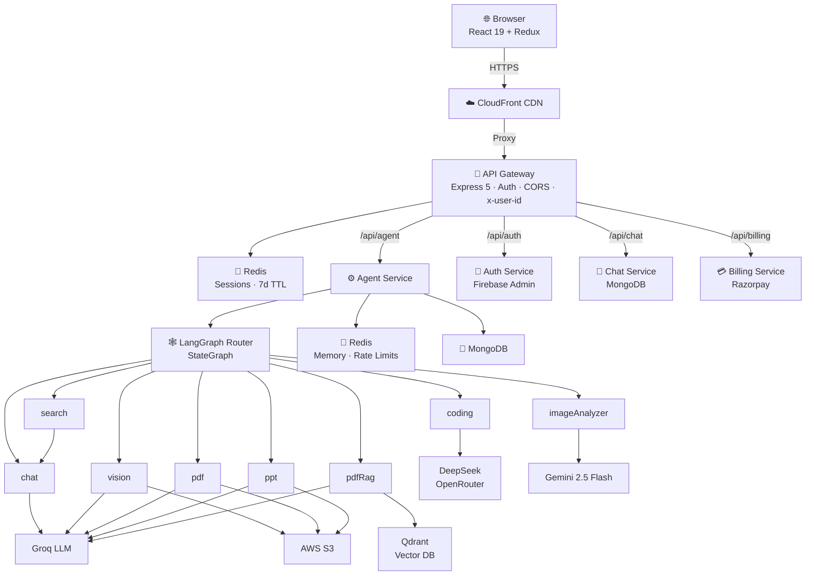
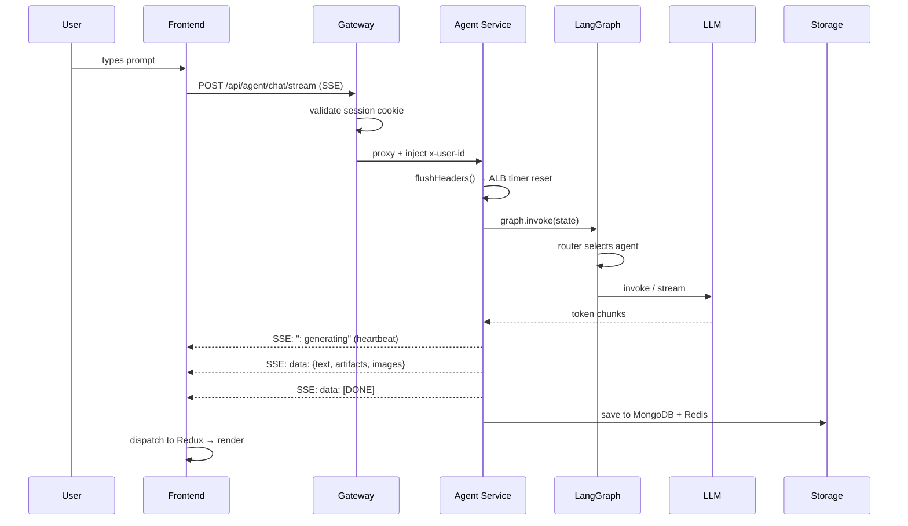

<div align="center">


# Ciel

**Multi-Agent AI Platform**

One conversation. Eight specialized AI agents. Powered by LangGraph.

[**Live Demo →**](https://dwi6z47ows1mt.cloudfront.net)&nbsp;&nbsp;·&nbsp;&nbsp;[**API**](https://d27rpohugccw7u.cloudfront.net)&nbsp;&nbsp;·&nbsp;&nbsp;[**Docs**](docs/)&nbsp;&nbsp;·&nbsp;&nbsp;[**Architecture**](docs/Architecture.md)

<br />


</div>

---

<div align="center">

<!-- Replace with actual screenshot -->


</div>

---

## What is Ciel?

Most AI assistants send every request to a single general-purpose model.

Ciel routes each request to the right specialist. A coding question goes to DeepSeek. An image generation request goes through a cinematic prompt pipeline. A PDF question triggers a full RAG pipeline with Qdrant vector search. A live news query hits Tavily search before the LLM ever sees it.

The router is a LangGraph `StateGraph`. Every agent is a node. The graph decides the path.

---

## Agents

<table>
<tr>
<td width="50%">

**🧠 Auto Router**
LangGraph LLM router. Reads conversation history and current prompt. Selects the best agent automatically. Explicit selection always overrides.

</td>
<td width="50%">

**💬 Chat**
General conversation, Q&A, summarization, math, translation.
`Groq` · Redis memory (20 msg / 24h TTL)

</td>
</tr>
<tr>
<td>

**💻 Coding**
Intent-classified. Generates full `HTML/CSS/JS` projects rendered in Monaco editor with live preview, or streams markdown for reviews, debugging, and explanations.
`DeepSeek via OpenRouter` · SSE streaming

</td>
<td>

**🎨 Vision**
Text-to-image generation. Groq engineers a cinematic prompt → Pollinations renders → S3 stores → signed URL returned.
`Groq + Pollinations` · SSE streaming

</td>
</tr>
<tr>
<td>

**🖼 Image Analyzer**
Upload any image. Ask any question. Answers grounded strictly in the image content.
`Gemini 2.5 Flash` · Auto-routed on image upload

</td>
<td>

**📄 PDF Generator**
Prompt → structured JSON → pdfkit renders → S3 upload → download link.
`Groq + pdfkit` · 24h signed URL

</td>
</tr>
<tr>
<td>

**📊 PPT Generator**
Prompt → structured JSON → pptxgenjs renders → S3 upload → `.pptx` download.
`Groq + pptxgenjs` · 24h signed URL

</td>
<td>

**🔍 Search**
Live web results via Tavily injected into chat context before LLM responds.
`Tavily + Groq` · Real-time grounding

</td>
</tr>
<tr>
<td colspan="2">

**📚 PDF RAG**
Upload a PDF. Ask questions. pdf-parse extracts text → chunked (1000/200) → embedded with `gemini-embedding-001` → stored in Qdrant → top-5 similarity search → Groq answers strictly from the document.
Auto-routed on PDF upload.

</td>
</tr>
</table>

---

## Architecture



---

## Engineering Decisions

**Why LangGraph instead of a plain if/else router?**
LangGraph models the agent pipeline as a directed graph with typed state. Adding a new agent is one `addNode` + one `addEdge`. The state flows through every node without manual passing. Conditional edges handle routing declaratively.

**Why SSE instead of WebSockets?**
The coding and vision agents can run for 60–120 seconds. AWS ALB has a hard 60s idle timeout. SSE lets the server push bytes continuously — each token chunk resets the ALB timer. A `setInterval` heartbeat every 15s acts as a safety net. WebSockets would require a separate upgrade path and NLB configuration.

**Why an API Gateway service?**
All five backend services are internal. The gateway is the only public surface. It validates the session cookie, injects `x-user-id` into every proxied request, and centralizes CORS. No service trusts the client directly.

**Why Redis for session storage instead of JWTs?**
Sessions can be invalidated instantly by deleting the Redis key. JWTs cannot be revoked without a blocklist — which is just Redis anyway. Redis also stores conversation memory (last 20 messages, 24h TTL) and per-user rate limit counters, so the infrastructure is already there.

**Why Qdrant for PDF RAG instead of in-memory vectors?**
Qdrant is a purpose-built vector database with HNSW indexing. In-memory approaches don't survive process restarts and don't scale. Qdrant runs as a separate service and can be swapped for Qdrant Cloud with one env var change.

**Why ECS Fargate instead of EC2?**
No instance management. Each service scales independently. The CI/CD pipeline fires `update-service` for all five services in parallel background processes — total deploy time is bounded by the slowest single service, not the sum.

**Why path-based CI/CD?**
`dorny/paths-filter` detects which service directories changed. A frontend-only commit never rebuilds any backend Docker image. A chat service change never triggers an agent rebuild. This keeps CI fast and ECR pull costs low.

---

## Tech Stack

**Frontend**


**Backend**


**AI / Orchestration**


**Cloud / DevOps**


---

## System Workflow



---

## Project Structure

```
Ciel/
├── .github/workflows/deploy.yml   # Path-filtered parallel CI/CD
├── backend/
│   ├── gateway/                   # Auth middleware, reverse proxy, CORS
│   ├── shared/redis/              # Shared Redis client
│   └── services/
│       ├── auth/                  # Firebase verify, sessions, credits
│       ├── billing/               # Razorpay orders + verification
│       ├── chat/                  # Conversation + message persistence
│       └── agent/
│           ├── agents/            # 8 agent implementations
│           ├── graph/             # LangGraph state, router, compiled graph
│           ├── config/            # LLMs, embeddings, Redis, S3, rate limits
│           └── util/              # S3, PDF/PPT generators, credit deduction
└── frontend/src/
    ├── component/                 # Chat UI, Artifact panel, Sidebar, Billing
    ├── pages/landing/             # Hero, Features, Pricing, FAQ, Workflow
    ├── redux/                     # conversationSlice, messageSlice, userSlice
    └── features/                  # API wrappers
```

---

## Getting Started

**Prerequisites:** Node.js 18+, Docker, MongoDB, Redis, Qdrant, Firebase project, AWS account, Groq / OpenRouter / Google AI / Tavily / Razorpay API keys.

```bash
# 1. Clone
git clone <your-repo-url> && cd Ciel

# 2. Start Redis locally
cd backend && docker compose up -d && cd ..

# 3. Install all services
for dir in backend/gateway backend/services/auth backend/services/billing \
           backend/services/chat backend/services/agent frontend; do
  (cd $dir && npm install)
done

# 4. Add .env files — see docs/Environment.md

# 5. Run (six terminals)
cd backend/gateway          && npm run dev   # :3000
cd backend/services/auth    && npm run dev   # :3001
cd backend/services/chat    && npm run dev   # :3002
cd backend/services/billing && npm run dev   # :3004
cd backend/services/agent   && npm run dev   # :3003
cd frontend                 && npm run dev   # :5173
```

> Full environment variable reference → [`docs/Environment.md`](docs/Environment.md)
>
> Full API reference → [`docs/API.md`](docs/API.md)

---

## Deployment

| Layer | Service |
|---|---|
| Frontend | S3 + CloudFront |
| Backend | ECS Fargate — one task per service |
| Registry | ECR — one repo per service |
| Database | MongoDB Atlas |
| Cache | Redis (ElastiCache or external) |
| Vectors | Qdrant Cloud |
| Files | S3 |

Push to `main` → GitHub Actions detects changed paths → builds only affected services in parallel → deploys all 5 ECS services simultaneously.

Full deployment guide → [`docs/Deployment.md`](docs/Deployment.md)

---

## Performance

| Optimization | Detail |
|---|---|
| SSE + ALB heartbeat | Token chunks reset ALB's 60s idle timer. `setInterval` every 15s as safety net. |
| Redis conversation cache | Last 20 messages cached per conversation, 24h TTL. No MongoDB read on every turn. |
| Context window trimming | Only last 6 messages injected into LLM prompt. Keeps latency and cost low. |
| Per-user rate limiting | Redis sliding window counters per agent. Enforced before any LLM call. |
| Docker layer cache | `type=gha` GHA cache. `npm install` layer reused when only source files change. |
| Path-based CI | `dorny/paths-filter` — unchanged services never rebuild or redeploy. |
| Parallel ECS deploy | All 5 `update-service` calls fire as bash background processes simultaneously. |
| S3 signed URLs | 24h expiry. No public bucket. Files served directly from S3, not through the API. |

---

## Roadmap

- [ ] Streaming for PDF and PPT agents
- [ ] Persistent Qdrant collections per user (multi-session PDF RAG)
- [ ] WebSocket upgrade path
- [ ] Conversation search in sidebar
- [ ] Multi-file upload
- [ ] Token usage tracking per conversation
- [ ] Admin usage dashboard
- [ ] Integration test suite for gateway and agent routes

---

## Contributing

1. Branch from `main`.
2. Preserve service boundaries — gateway, auth, chat, billing, agent stay separated.
3. New agent? Update `graph.js`, `router.js`, `state.js`, `llmModels.js`, `agentlimit.js`, and this README.
4. `npm run lint && npm run build` before opening a PR.

---

## License

MIT © [TANMAY KUMAR]

---

<div align="center">

[Live Demo](https://dwi6z47ows1mt.cloudfront.net) · [API](https://d27rpohugccw7u.cloudfront.net) · [Docs](docs/) · [Report Bug](../../issues) · [Request Feature](../../issues)

</div>
