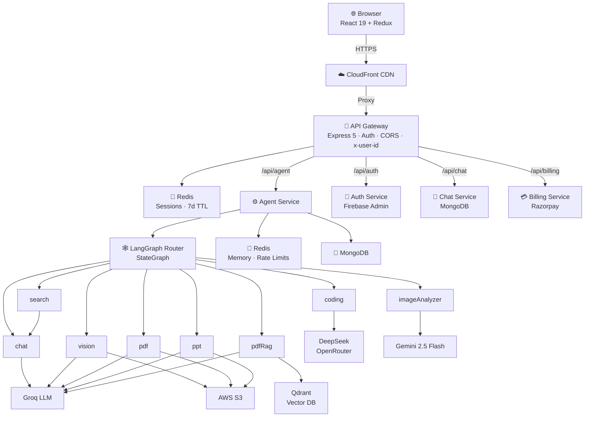

# Architecture

## High-Level Overview



## LangGraph State

Every agent receives and returns the same typed state object:

```js
{
  prompt, conversationId, agent, userId,
  file, streamRes,          // inputs
  aiResponse, images,       // outputs
  artifacts, searchResults  // agent-specific outputs
}
```

## SSE Streaming

Agents that can exceed 60s (coding, vision, auto) use the SSE route:

1. `flushHeaders()` called immediately — sends HTTP headers to ALB, resetting the idle timer
2. `setInterval` heartbeat every 15s writes `: heartbeat\n\n`
3. Coding agent writes `: generating\n\n` per token chunk during generation
4. Final event: `data: { text, artifacts, images }\n\n`
5. Termination: `data: [DONE]\n\n`

## Service Boundaries

- **Gateway** — only public service. Validates session cookie, injects `x-user-id`, proxies.
- **Auth** — Firebase token verification, session management, credit deduction.
- **Chat** — conversation and message CRUD. No LLM logic.
- **Agent** — all LLM orchestration. Calls auth service for credit deduction.
- **Billing** — Razorpay integration. Calls auth service to update credits after payment.
